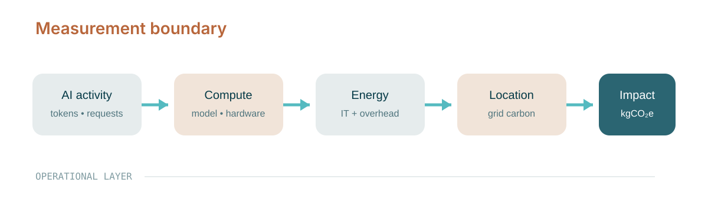
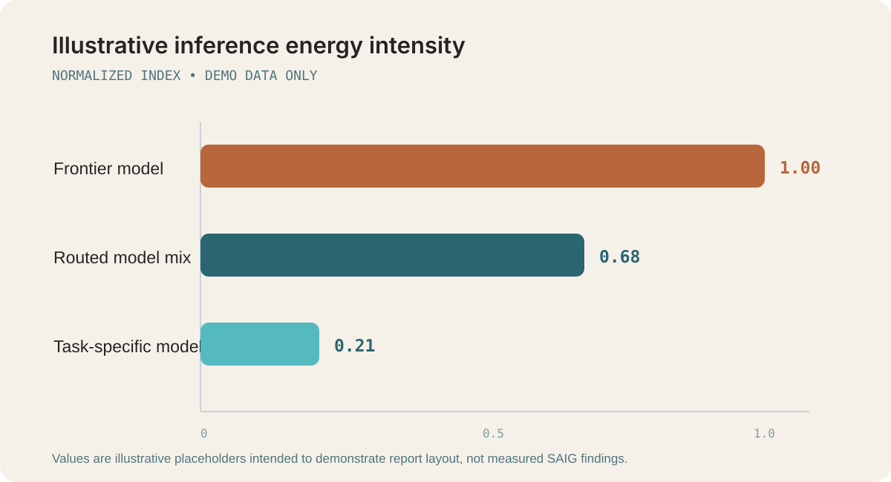

```{=html}
<div class="saig-cover">
  <div>
    <div class="saig-logo-card"></div>
    <div class="saig-kicker" style="margin-top:3.2rem;">Technical Report</div>
    <h1>CLEER<br>Technical Report</h1>
    <div class="subtitle">Estimating the energy use of closed AI model inference.</div>
    <a class="pdf-button" href="index.pdf" target="_blank" rel="noopener noreferrer">↓ Download PDF</a>
  </div>
  <div class="saig-cover-meta">
    <span>VERSION: 0826</span><span>29 SEPTEMBER 2026</span>
  </div>
</div>
```

```{=typst}
#set page(margin: 0pt, header: none, footer: none, numbering: none)

#place(top + left, dx: 0pt, dy: 0pt)[
  #image("assets/pdf-cover-bg.png", width: 8.5in, height: 11in, fit: "cover")
]

#place(top + left, dx: 0.52in, dy: 0.66in)[
  #block(width: 3.48in, fill: white, radius: 11pt, inset: 12pt)[
    #image("assets/saig-logo.png", width: 2.96in)
  ]
]

#place(top + left, dx: 0.58in, dy: 2.20in)[
  #text(font: "DM Mono", size: 14pt, tracking: 0.8pt, fill: rgb("#242424"))[TECHNICAL REPORT]
]

#place(top + left, dx: 0.58in, dy: 3.03in)[
  #text(font: "Inter", size: 55pt, weight: "medium", fill: rgb("#B8663B"))[CLEER]
]

#place(top + left, dx: 0.58in, dy: 3.9in)[
  #text(font: "DM Mono", size: 18pt, tracking: 0.8pt, fill: rgb("#B8663B"))[[Closed-model Latent Energy Estimation Range]]
]

#place(top + left, dx: 0.58in, dy: 4.8in)[
  #block(width: 6.90in)[
    #set par(leading: 0.72em)
    #text(font: "Source Serif 4", size: 26pt, fill: rgb("#242424"))[
      Estimating the energy use of closed AI model inference.
    ]
  ]
]

#place(top + left, dx: 0.58in, dy: 8.5in)[
  #block(width: 6.90in)[
    #set par(leading: 0.72em)
    #text(font: "Source Serif 4", size: 14pt, fill: rgb("#242424"))[
      By Nidhal Jegham, Chan Young Koh, Sasha Luccioni
    ]
  ]
]

#place(top + left, dx: 0.58in, dy: 9.20in)[
  #block(width: 7.34in, height: 0.98in, fill: white, radius: 11pt, inset: 14pt)[
    #grid(
      columns: (1fr, 1fr),
      gutter: 14pt,
      [#text(font: "DM Mono", size: 10.5pt, fill: rgb("#4F747D"))[VERSION]],
      [#text(font: "DM Mono", size: 10.5pt, fill: rgb("#4F747D"))[DATE]],
    )
    #v(5pt)
    #grid(
      columns: (1fr, 1fr),
      gutter: 14pt,
      [#text(font: "DM Mono", size: 11pt, weight: "medium", fill: rgb("#033845"))[CLEER-TEXT-0826]],
      [#text(font: "DM Mono", size: 11pt, weight: "medium", fill: rgb("#033845"))[29 SEPTEMBER 2026]],
    )
  ]
]

#pagebreak()
#set page(
  margin: (top: 0.72in, bottom: 0.72in, left: 0.62in, right: 0.62in),
  header: saig-header,
  footer: saig-footer,
  numbering: none,
)

#show heading.where(level: 1): it => block(above: 12pt, below: 14pt)[
  #text(font: "DM Mono", size: 6.4pt, tracking: 0.7pt, fill: rgb("#819CA2"))[SECTION #context counter(heading).display("01")]
  #v(4pt)
  #text(font: "Inter", size: 25pt, weight: "medium", fill: rgb("#B8663B"))[#it.body]
]
#show heading.where(level: 2): it => block(above: 13pt, below: 8pt)[
  #text(font: "Inter", size: 15pt, weight: "medium", fill: rgb("#2B6572"))[#it.body]
]
#show heading.where(level: 3): it => block(above: 10pt, below: 5pt)[
  #text(font: "Inter", size: 11.5pt, weight: "medium", fill: rgb("#2B6572"))[#it.body]
]
```


# Executive summary

::: {.lede}
This is intentionally **illustrative content**, not a client analysis. Its purpose is to show the reporting system: one source file, technical visuals, source citations, a polished web layer, and a publication-quality PDF.
:::


```{=typst}
#grid(
  columns: (1fr, 1fr, 1fr),
  gutter: 12pt,
  [#block(height: 1.18in, fill: rgb("#F5F1E9"), radius: 10pt, inset: 14pt, stroke: (top: 4pt + rgb("#2B6572")))[
    #text(font: "Inter", size: 17pt, weight: "semibold", fill: rgb("#033845"))[1 SOURCE]
    #v(8pt)
    #text(font: "DM Mono", size: 6.4pt, fill: rgb("#4F747D"))[QUARTO MARKDOWN]
  ]],
  [#block(height: 1.18in, fill: rgb("#FBF2EA"), radius: 10pt, inset: 14pt, stroke: (top: 4pt + rgb("#B8663B")))[
    #text(font: "Inter", size: 17pt, weight: "semibold", fill: rgb("#033845"))[2 OUTPUTS]
    #v(8pt)
    #text(font: "DM Mono", size: 6.4pt, fill: rgb("#4F747D"))[HTML + TYPST PDF]
  ]],
  [#block(height: 1.18in, fill: rgb("#EFF8F8"), radius: 10pt, inset: 14pt, stroke: (top: 4pt + rgb("#55BAC0")))[
    #text(font: "Inter", size: 17pt, weight: "semibold", fill: rgb("#033845"))[∞ VERSIONS]
    #v(8pt)
    #text(font: "DM Mono", size: 6.4pt, fill: rgb("#4F747D"))[GIT TRACKED]
  ]],
)
#v(10pt)
```

AI training and deployment occur primarily in data centres, making electricity demand and data-centre infrastructure central to environmental assessment [@iea2025]. Research also shows that inference impacts can vary substantially across model and task choices [@luccioni2024]. A defensible assessment therefore needs to connect **AI activity → compute → energy → location → emissions**, while documenting assumptions and uncertainty.

```{=html}
<div class="kpi-grid">
  <div class="kpi"><div class="value">1 source</div><div class="label">Quarto Markdown</div></div>
  <div class="kpi"><div class="value">2 outputs</div><div class="label">HTML + Typst PDF</div></div>
  <div class="kpi"><div class="value">∞ versions</div><div class="label">Git tracked</div></div>
</div>
```

::: {.content-visible when-format="html"}

| Demonstrated capability | Web report | PDF |
|---|:---:|:---:|
| SAIG typography and colors | ✓ | ✓ |
| Hoverable citations | ✓ | — |
| Numbered bibliography | ✓ | ✓ |
| Technical SVG figures | ✓ | ✓ |
| Equations and cross-references | ✓ | ✓ |
| One-click PDF access | ✓ | n/a |

:::

::: {.callout-note title="What is real vs. illustrative?"}
The sources and general methodological statements are real. All numerical findings in this demo are placeholders created solely to exercise the design system.^[For an actual engagement, these values would be generated from client activity data, model/hardware characterization, data-centre factors, and location-specific electricity data.]
:::

```{=typst}
#pagebreak()
```

# Measurement approach

A useful reporting architecture separates **activity data** from **impact factors**. For inference, a simplified calculation can be expressed as:

$$
E_{\text{inference}} = A_{\text{tokens}} \times I_{\text{model}} \times PUE
$$ {#eq-energy}

and operational emissions as:

$$
GHG_{\text{operational}} = E_{\text{inference}} \times CI_{\text{electricity}}
$$ {#eq-ghg}

This is deliberately simplified: a production methodology would define boundaries, allocation rules, hardware utilization, uncertainty, and the treatment of embodied impacts. GHG Protocol principles emphasize relevance, completeness, consistency, transparency, and accuracy when constructing emissions inventories [@ghgscope3].

::: {.figure-frame}
{#fig-boundary width=100%}
:::

@tbl-boundary shows how a report can make assumptions explicit rather than burying them in prose.

| Layer | Example input | Typical evidence | Demo treatment |
|---|---|---|---|
| AI activity | tokens, requests, GPU-hours | platform logs, vendor exports | In scope |
| Model / hardware | model family, accelerator | provider disclosure, benchmark | In scope |
| Data-centre overhead | PUE, cooling allocation | facility/provider data | Assumption |
| Electricity | regional grid mix | grid datasets, contractual instruments | In scope |
| Embodied impacts | hardware + construction | LCA / supplier data | Separate module |

: Measurement boundary and evidence hierarchy {#tbl-boundary}

```{=typst}
#pagebreak()
```

# Illustrative findings

The figure below is intentionally synthetic, but demonstrates how a result can be presented in a way that works identically in browser and PDF.

::: {.figure-frame}
{#fig-energy width=100%}
:::

A result like @fig-energy would normally be accompanied by a traceable evidence table and sensitivity analysis. The underlying idea is supported by empirical research showing material differences in deployment energy across tasks and model architectures [@luccioni2024].

::: {.callout-important title="Key finding" icon=false}
The executive reader should be able to understand the decision in thirty seconds; the technical reviewer should be able to trace every material assumption.
:::

## Example sensitivity table

| Scenario | Normalized energy | Grid intensity (gCO₂e/kWh) | Resulting index |
|---|---:|---:|---:|
| Baseline frontier model | 1.00 | 400 | 1.00 |
| Routed model mix | 0.68 | 400 | 0.68 |
| Routed + lower-carbon region | 0.68 | 120 | 0.20 |
| Task-specific model | 0.21 | 400 | 0.21 |

The point of the table is not the sample values. It is the **reporting pattern**: inputs are visible, results are comparable, and the reader can distinguish model-efficiency effects from electricity-location effects.

```{=typst}
#pagebreak()
```

# Recommendations

For a client-facing version, recommendations can be organized by decision horizon rather than by technical subsystem.

### 1. Establish a repeatable measurement baseline

Define the activity-data schema, model taxonomy, data-quality hierarchy, and evidence retention requirements. This creates a consistent baseline that can be updated without rebuilding the analysis from scratch.

### 2. Prioritize the highest-leverage routing decisions

Use model- and task-level measurements to identify where a smaller or more specialized model can satisfy quality requirements at lower energy intensity. Research on deployment impacts suggests these choices can materially affect inference energy [@luccioni2024].

### 3. Integrate results into corporate reporting

Map material upstream AI-related emissions into the organization's established GHG accounting process, with explicit boundaries, assumptions, and exclusions consistent with applicable reporting practices [@ghgscope3].

::: {.callout-tip title="Why GitHub helps"}
Every methodological change, source update, chart revision, and client comment can be reviewed as a diff. The published HTML and PDF can then be regenerated automatically from the approved source.
:::

```{=typst}
#pagebreak()
```

# Technical notes

## What the source tree controls

`_brand.yml`
: Auto-detected base brand (colors and typography only; no logo).

`brand-html.yml`
: HTML-specific brand, including the SAIG logo.

`styles.scss`
: Web-only polish: hero treatment, KPI cards, spacing, responsive behavior, and table details.

`typst/saig-header.typ`
: PDF-only page-level treatment such as headers and footers.

`references.bib`
: Central bibliography. Cite a source with `[@source-key]`; the browser version exposes the reference on hover.

`assets/`
: Brand-approved logo/background assets plus reusable SVG graphics.

## Production notes

For a real report, numerical outputs should come from a reproducible data pipeline rather than manually entered tables. Quarto can execute Python or R during render, but keeping calculations separate from the layout layer is often useful for review and assurance.

